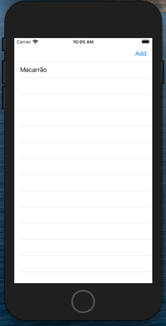
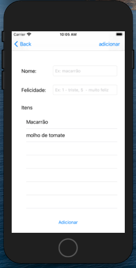
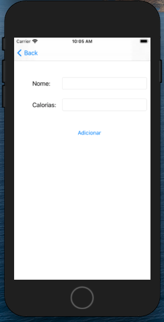

<h1 align="center">Welcome to Eggplant Brownie IOS APP 👋</h1>

  

> This is a case for study to create an app for IOS system

## Author

👤 **Luiz Carlos Rocha Correa**

* Website: https://www.linkedin.com/in/luizcarlosrochacorrea/
* Github: [@luizkrlz](https://github.com/luizkrlz)

## APP

<video width="320" height="240" controls>
  <source src="video.mov" type="video/mp4">
</video>

## Screenshots

## Show your support

Give a ⭐️ if this project helped you!

***
_This README was generated with ❤️ by [readme-md-generator](https://github.com/kefranabg/readme-md-generator)_